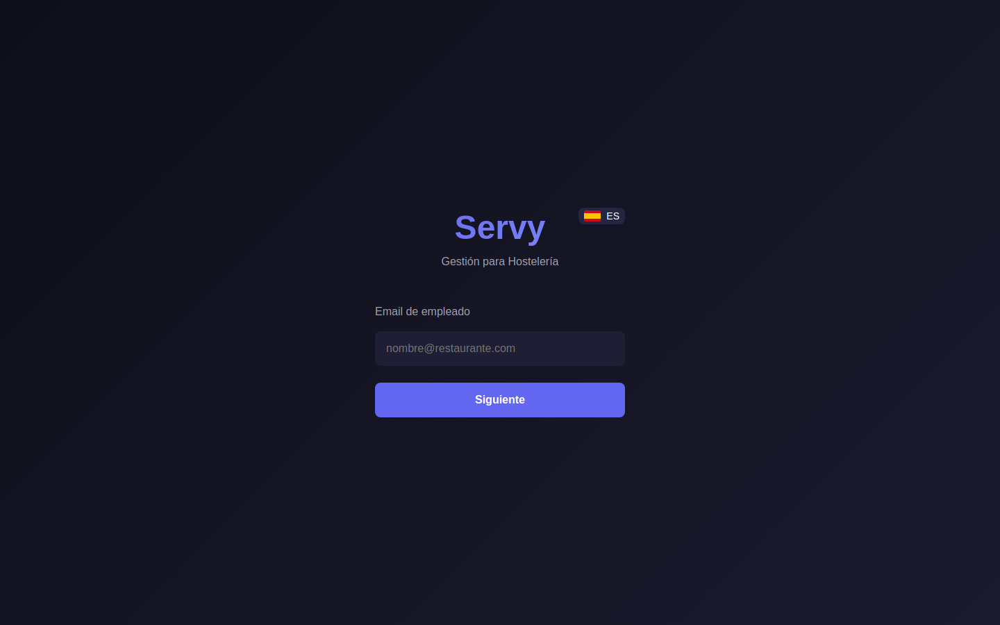

# SERVY

> Hospitality POS with Spanish Veri*Factu compliance

**Live:** [https://servy.alcuavi.com](https://servy.alcuavi.com) · **Category:** Product / Hostelería + Fintech

## Overview

SERVY is a restaurant management suite (POS, kitchen display, bar, cashier, delivery, QR self-ordering) built around a **from-scratch Veri*Factu engine**: cryptographic hash-chained fiscal records, QR-embedded tickets, and AEAT-ready XML export — plus realtime kitchen/table updates via Go WebSockets and Redis pub/sub.

## Problem → Solution

**Problem.** Spanish hospitality businesses must comply with Veri*Factu (2025–2026): immutable invoice chains, QR tickets, and tax-authority reporting — while still running a fast counter and live kitchen.

**Solution.** Go 1.23 Fiber API with raw `pgx` SQL for low latency, dedicated `verifactu` package (hash chain, QR, XML), Redis-backed WebSocket hub fanning kitchen/table/order channels, and a SvelteKit PWA serving five staff-role UIs from one codebase.

## Key capabilities

- Custom hash-chain fiscal records with independent chain-integrity verification
- Realtime multi-station ops without polling (Redis pub/sub → WebSocket hub)
- One SvelteKit PWA: POS, KDS, bar, cash, delivery, public QR menu
- Performance-first backend: Fiber + pgx, no ORM at the counter
- Bilingual ES/EN across API keys and UI

## Skills demonstrated

- Regulatory software (Veri*Factu)
- Realtime systems
- Go backend architecture
- Multi-role SPA design
- Fiscal audit trails

## Tech stack

- Go 1.23, Fiber, pgx, JWT, bcrypt
- SvelteKit 2 / Svelte 4 PWA, Vite
- PostgreSQL 16, Redis 7
- Docker Compose, Makefile workflows

## Screenshots

_Sanitized captures — no credentials, customer data, or private business figures._

### SERVY POS login (captured from production stack — no tenant data)

See also: [docs/screenshots/README.md](docs/screenshots/README.md)

## Documentation

| Document | Description |
|----------|-------------|
| [Architecture](./docs/architecture.md) | Components, data flow, diagrams |
| [Technical decisions](./docs/technical-decisions.md) | Trade-offs and rationale |
| [Scope & privacy](./docs/scope-and-privacy.md) | What this case study shows / omits |

## Private source

Application code: [`Alcuavi/SERVY`](https://github.com/Alcuavi/SERVY) (private repository)

## Honesty note

Production deploy on personal VPS. Regulatory module is engineered to spec; always validate with a tax advisor for commercial use.

## What we intentionally do not publish here

- JWT/dev secrets from compose files
- Real restaurant NIFs, fiscal XML output, or tenant data
- Claiming full automated test coverage (suite still maturing)

---

## About the author

**Alberto Cuadrado** — Full Stack Developer building AI-powered products, internal tools, and production systems.

- Portfolio: [alcuavi.com](https://alcuavi.com)
- GitHub: [@Alcuavi](https://github.com/Alcuavi)

## Repository notice

This is a **public case study**. Application source code lives in a **private repository** linked above. This repo intentionally contains documentation only — no secrets, credentials, customer data, or proprietary media assets.
