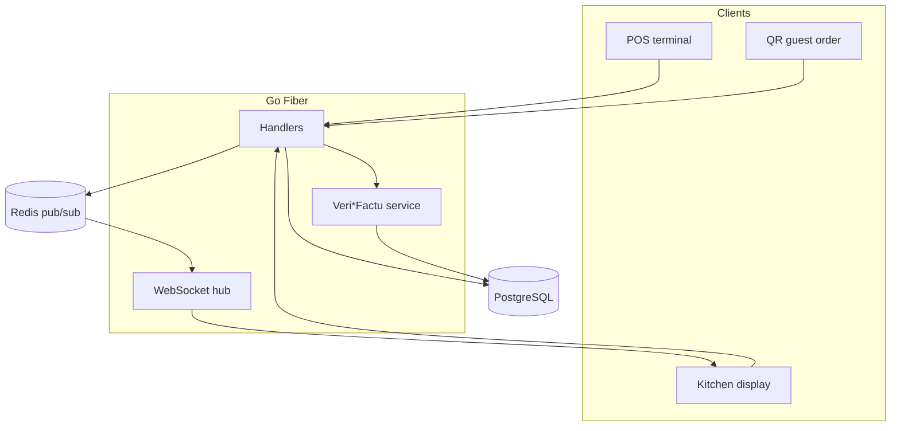

# Architecture — SERVY

## System context

SERVY is a restaurant management suite (POS, kitchen display, bar, cashier, delivery, QR self-ordering) built around a **from-scratch Veri*Factu engine**: cryptographic hash-chained fiscal records, QR-embedded tickets, and AEAT-ready XML export — plus realtime kitchen/table updates via Go WebSockets and Redis pub/sub.

## Diagram

## Data & trust boundaries

- **Public case study (this repo):** documentation and diagrams only.
- **Private application repo:** [`Alcuavi/SERVY`](https://github.com/Alcuavi/SERVY) — credentials, customer data, and proprietary assets stay there.
- **Production deployment:** https://servy.alcuavi.com

## Operational notes

Production deploy on personal VPS. Regulatory module is engineered to spec; always validate with a tax advisor for commercial use.
